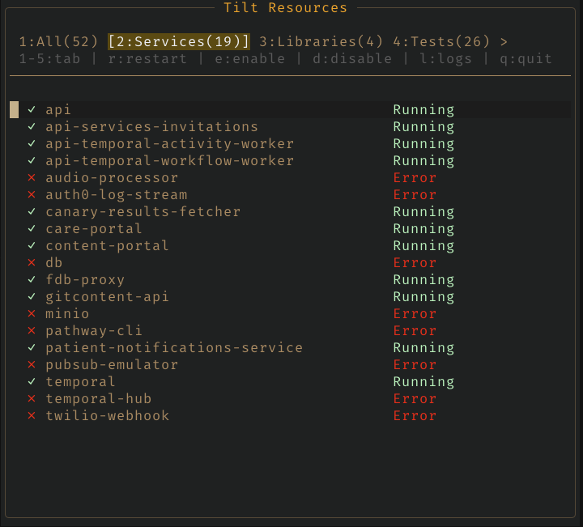

# Tilt extension for VSCode

- [Tilt extension for VSCode](#tilt-extension-for-vscode)
  - [Important notes](#important-notes)
  - [Features](#features)
  - [Requirements](#requirements)
  - [Extension Settings](#extension-settings)

We recently started using Tilt to manage all of the different services in our monorepo at work.
It's been a pleasure to use, but I was longing for a way to restart or disable/enable resources without switching to my browser and finding the Tilt console tab.
So I spent a few days trying to "reverse engineer" their web console API to use in a VSCode extension, and this is it.

## Important notes

This is an alpha-stage extension that is built using one very specific Tiltfile from work, which ironically doesn't even use Kubernetes.
Therefore, this might be buggy - or even completely broken - for you.
If that's the case, I'd appreciate any reports through GitHub Issues with an easily reproducible example.

## Features

- See a list of all of your Tilt resources and their statuses, organized by their shared labels
- Restart, disable, or re-enable any resource

## Requirements

- A running Tilt server

## Extension Settings

- `vscode-tilt.tiltServerHostname`: The hostname for your Tilt server. Default: `'localhost'`.
- `vscode-tilt.tiltServerPort`: The port for your Tilt server. Default: `10350`.
